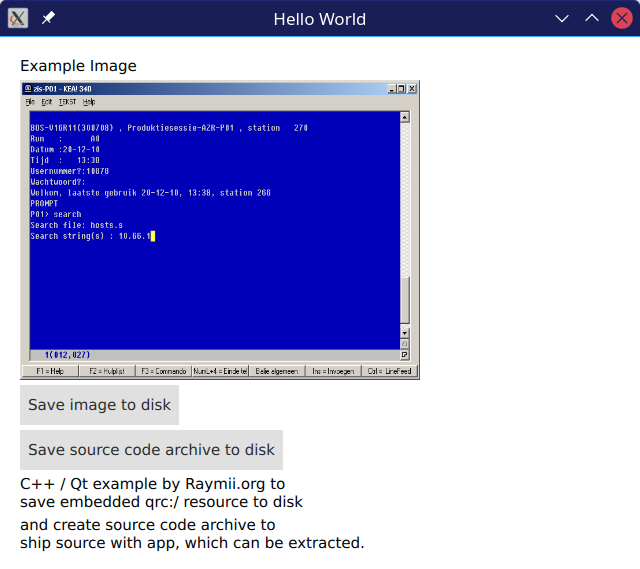

# qrcToDisk

Generate archive with sourcecode using qmake and save 
it to disk on desktop and android. Can be used to ship 
source code with application.

[Full article here](https://raymii.org/s/articles/Embed_the_source_code_directly_in_your_Qt_app.html)
